

   

# 🏠 **Pocket Room**
**Design phase**

 

  

| **Student No** | 22212047 |
| :---: | :---: |
| **Name** | 임현우 |
| **E-mail** | dlagusdn9182@gmail.com |
| **GitHub** | [repository](https://github.com/dlagusdn0204/OSS-Design-Project-Pocket-room-/tree/main) |

   

---

# **Revision history**
 

| Revision date | Version # | Description | Author |
| :---: | :---: | :---: | :--- |
| 05/31/2026 | 1.00 | First draft  | 임현우 |

 

---

# **Contents**

<pre style="display: inline-block; text-align: left; border: none; background: none;">
1. Introduction
2. Class diagram
3. Sequence diagram
4. Design decisions
5. Implementation requirements
6. Glossary
7. References
</pre>

   

---

# 1. Introduction

**1.1 Summary**

> 본 문서는 Analysis 단계의 문서에 이어지는 Pocket Room의 Design 단계 문서이다. Pocket Room은 자취생을 포함하여 집에 거주하며 공과금·월세를 납부하는 사용자를 위한 통합 공과금/월세 관리 모바일 앱이다. 사용자의 월별 전기요금, 도시가스요금, 월세, 집주소 등 거주 관련 정보를 하나의 Dashboard에 카드 형태로 통합하여 보여준다.
>
> Analysis 단계에서 정의한 Use case와 Domain class를 바탕으로, 본 Design 문서에서는 이를 실제 구현 가능한 수준으로 구체화한다. 각 클래스의 속성(attribute)과 연산(operation)을 명시한 Class diagram을 작성하고, 주요 사용자 시나리오에 대한 Sequence diagram을 통해 객체 간 상호작용의 흐름을 정의한다.

**1.2 Purpose of design phase**

> 1. 9개 Domain class를 속성·연산·관계가 명시된 Class diagram으로 확장한다.
> 2. 핵심 Use case를 객체 간 메시지 흐름으로 표현한 Sequence diagram을 작성한다.
> 3. 기술 스택·보안·외부 연동 등 주요 설계 의사결정과 그 근거를 정리한다.

**1.3 Goal**

> 이번 Design 보고서는 크게 3가지 목표를 가진다.
>
> 1. **Class diagram** 을 통해 시스템을 구성하는 클래스들의 정적 구조(속성, 연산, 관계)를 정의한다.
> 2. **Sequence diagram** 을 통해 주요 기능이 실행될 때 객체들이 시간 순서에 따라 어떻게 상호작용하는지 동적 흐름을 정의한다.
> 3. **Design decisions** 를 통해 기술 선택과 설계 원칙의 근거를 기록하여 Implementation의 일관성을 확보한다.

**1.4 Scope**

> 본 Design 문서가 **다루는 범위**는 **클라이언트(앱) + 백엔드 서버**로 구성된 시스템 전체를 설계 범위로 한다.
> - **클라이언트** 계층(UI / State(Provider) / API Client / Domain)의 속성·연산·관계 정의
> - **백엔드 서버** 계층(Controller / Service / Integration / Data Access / DB)의 책임·클래스 식별
> - 두 시스템을 잇는 **REST API 명세**(엔드포인트·요청·응답)와 **토큰 기반 인증**(JWT access/refresh) 설계
> - 회원가입/로그인, 방 추가, 대시보드 조회, 카드 설정, 납부 알림, **요금 수신(서버 경유)** 등 핵심 시나리오의 흐름 — 네트워크 경계를 포함
> - 서버 측 영구 저장(DB), 클라이언트 측 민감정보 보관(Keychain/Keystore)·로컬 캐시 설계
> - 무료 클라우드(예: Render) 배포 구성
> - 계약서 OCR의 실제 인식 알고리즘 (현재는 stub 인터페이스로만 설계)
> - 도시가스 사별 API의 실제 연동
> - 소셜 로그인, 다기기 실시간 동기화 등 추가 확장 기능
> - 개인사용자의 전력 사용량 정보api를 제공하는 한전 OPM의 데이터 제공 규칙(과제 또는 학부 연구의 목적으로 api를 제공하지 않는다) 때문에 **실데이터를 받을 수 없다.** 실데이터는 앱의 정식 출시의 조건을 갖추었을때 한전OPM에서 제공받을수 있기에 본 설계에서는 서버의 Integration 계층이 실제 한전 API를 호출하는 대신, **예시 응답(sample payload)을 입력받아 파싱하여 앱까지 연동되는 결과를 시연**하는 방식으로 구현한다. 서비스 출시 시 이 계층의 구현만 실제 OPM 호출로 교체하면 된다. OCR(ContractScanner) 역시 인터페이스만 정의하며 실제 구현은 추후 보완된다.

   

---

# 2. Class diagram

> 본 시스템은 **클라이언트(앱) + 백엔드 서버**로 구성된 분산 시스템이다. **클라이언트**는 **Flutter(Dart)** 로, **백엔드 서버**는 **Node.js(Express)** 로 구현한다. 따라서 클라이언트 Class diagram은 Dart 타입 표기를, 서버는 일반 OOP 타입 표기를 기준으로 한다.
>
> 설계의 큰 원칙은 **계층 분리(layered architecture)** 이다. 클라이언트는 화면을 담당하는 UI 계층, 상태를 관리하는 State 계층, 서버를 호출하는 API Client 계층, 데이터 모델인 Domain 계층으로 나눈다. 백엔드 서버는 요청을 받는 Controller 계층, 로직을 담은 Service 계층, 외부(한전) 연동 Integration 계층, DB 접근 Data Access 계층으로 나눈다. 이렇게 분리하면 한 계층의 변경(예: 화면 디자인 수정)이 다른 계층(데이터 로직)에 영향을 주지 않으며, **네트워크 경계를 사이에 두고 양쪽이 독립적으로 진화**할 수 있다.
>
> 클래스 수가 많아 가독성을 위해 계층별로 다이어그램을 나누어 표현한다 — **클라이언트**: 2.2 Domain · 2.6 UI · 2.7 State & Service(API Client 포함) · 2.9 변경점 / **서버**: 2.8 Backend / **연결**: 2.10 API 명세. 가시성 표기는 `+` public, `-` private, `#` protected를 따르며, `List~Room~` 은 제네릭 `List<Room>` 을 의미한다.
>
> **클래스 상세 설명(class description)의 범위**: Domain(2.3)·State & Service(2.7)·Backend(2.8)·신규 클라이언트 클래스(2.9)는 클래스별로 책임 설명과 주요 속성·연산 표를 둔다. **UI 계층(2.6)만 예외로 다이어그램 + 요약표로 갈음**하는데, UI는 Flutter 위젯(`build()` 중심의 시각 요소)이라 속성·연산보다 화면 구성·네비게이션이 핵심이고, 다이어그램과 요약표·관계도로 충분히 설명되기 때문이다.

## 2.1 Layered architecture overview

> 시스템 전체를 **클라이언트(앱)** 와 **백엔드 서버** 두 묶음으로 나누어, 각 묶음 안의 계층과 그 사이의 통신을 표현하면 다음과 같다. 클라이언트 내부 의존은 **위(UI) → 아래(API Client)** 한 방향으로 흐르고, 두 시스템은 **네트워크 경계(HTTPS/JSON)** 를 사이에 두고 통신한다.

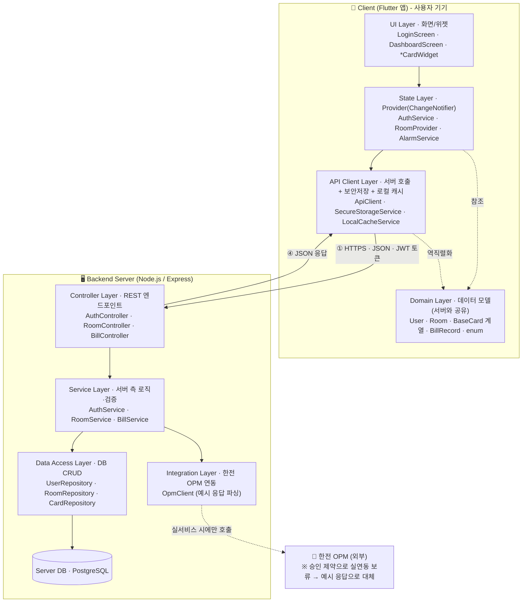

> **클라이언트 계층**
> - **UI Layer**: 사용자가 보고 조작하는 화면(Screen)과 재사용 부품(Widget). 입력을 받아 State에 전달하고 Domain 데이터를 표시한다.
> - **State Layer (Provider)**: `ChangeNotifier`를 상속한 `AuthService`·`RoomProvider`·`AlarmService`. 상태가 바뀌면 `notifyListeners()`로 화면을 다시 그린다. 로컬 처리 대신 **API Client를 통해 서버에 작업을 위임**하도록 내부가 바뀐다(2.9 참조).
> - **API Client Layer**: 서버에 HTTP 요청을 보내고 JSON 응답을 Domain 객체로 변환한다. JWT 토큰을 `SecureStorageService`(Keychain/Keystore)에 보관하고 매 요청에 첨부하며, 오프라인 대비 로컬 캐시를 둔다. *기존 로컬 전용 `StorageService`/`ExternalProvider`의 자리를 대체*한다.
> - **Domain Layer**: 핵심 데이터 모델(User, Room, BaseCard 및 카드 3종, BillRecord)과 열거형(CardType, GasCompany). 순수 데이터 객체이며, **클라이언트-서버가 주고받는 JSON의 공통 계약(스키마)** 역할도 한다.
>
> **백엔드 서버 계층**
> - **Controller Layer**: REST 엔드포인트의 입구. 요청을 받아 JWT 토큰을 검증하고 Service로 전달, 결과를 JSON으로 응답한다.
> - **Service Layer**: 서버 측 비즈니스 로직(비밀번호 해시 검증, 토큰 발급, 캐시 판단, 데이터 가공).
> - **Integration Layer**: 한전 OPM과 통신하는 계층으로 **API 키를 서버에만 보관**한다. 본 과제에서는 실데이터 대신 **예시 토큰으로** `BillRecord`로 변환한다.
> - **Data Access Layer + DB**: 서버 데이터베이스와의 상호작용을 담당한다.

## 2.2.1 Domain layer — class diagram

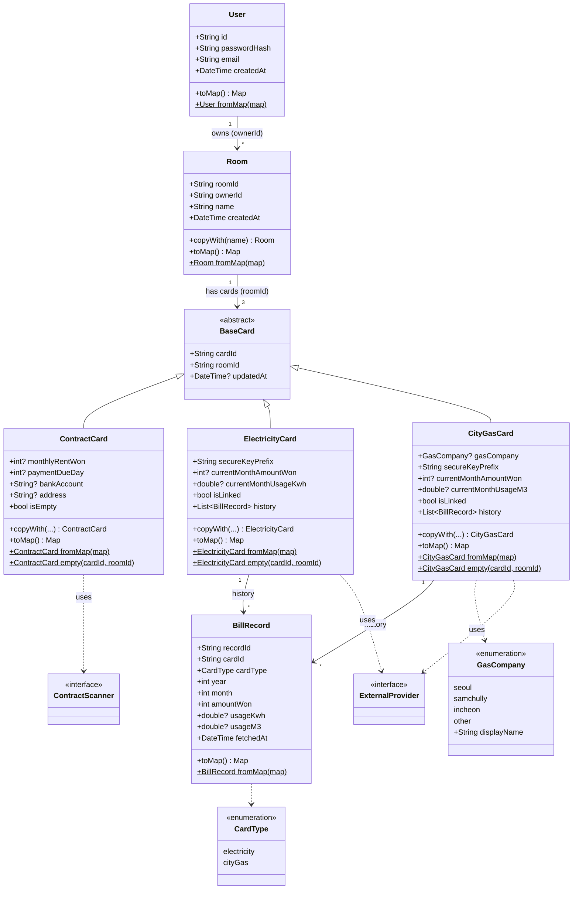

## 2.2.2 Domain layer — class descriptions

### User

| Name | Type | Visibility | Description |
| :--- | :--- | :---: | :--- |
| id | String | + | 사용자 로그인 아이디(PK) |
| passwordHash | String | + | SHA-256 해시 처리된 비밀번호(평문 저장 금지) |
| email | String | + | 사용자 이메일 |
| createdAt | DateTime | + | 계정 생성 일시 |

| Operation | Returns | Visibility | Description |
| :--- | :--- | :---: | :--- |
| toMap() | Map | + | SQLite 저장용 직렬화 |
| fromMap(map) | User | + | SQLite 조회용 역직렬화(factory) |

### Room

| Name | Type | Visibility | Description |
| :--- | :--- | :---: | :--- |
| roomId | String | + | 방 고유 식별자(PK) |
| ownerId | String | + | 소유자(User)의 id(FK) |
| name | String | + | 방 이름(예: "본가", "학교 근처 자취방") |
| createdAt | DateTime | + | 생성 일시 |

| Operation | Returns | Visibility | Description |
| :--- | :--- | :---: | :--- |
| copyWith(name) | Room | + | 이름만 바꾼 복사본 반환(불변 패턴) |
| toMap() | Map | + | SQLite 저장용 직렬화 |
| fromMap(map) | Room | + | SQLite 조회용 역직렬화(factory) |

> 설계 단계의 `Dashboard` 도메인 클래스는 별도 클래스로 구현하지 않았다. "한 방의 세 카드를 통합 표시·갱신"하는 책임은 `DashboardScreen`(표시) + `RoomProvider`(현재 방 상태) + `StorageService`(카드 로드)가 나누어 맡는다.

### BaseCard (abstract)

| Name | Type | Visibility | Description |
| :--- | :--- | :---: | :--- |
| cardId | String | + | 카드 식별자(PK) |
| roomId | String | + | 소속 방 식별자(FK) |
| updatedAt | DateTime | + | 마지막 갱신 시각(없을 수 있음) |

### ContractCard (extends BaseCard)

| Name | Type | Visibility | Description |
| :--- | :--- | :---: | :--- |
| monthlyRentWon | int | + | 월세 금액(원 단위 정수) |
| paymentDueDay | int | + | 월세 납부일(1~31) |
| bankAccount | String | + | 납부 계좌번호 |
| address | String | + | 집 주소 |

| Operation | Returns | Visibility | Description |
| :--- | :--- | :---: | :--- |
| isEmpty | bool | + | 네 필드가 모두 비었는지 여부(getter) |
| copyWith(...) | ContractCard | + | 일부 필드만 바꾼 복사본 반환 |
| toMap() / fromMap(map) | Map / ContractCard | + | SQLite 직렬화·역직렬화 |
| empty(cardId, roomId) | ContractCard | + | 빈 카드 생성(방 생성 시 자동, factory) |

### ElectricityCard (extends BaseCard)

| Name | Type | Visibility | Description |
| :--- | :--- | :---: | :--- |
| secureKeyPrefix | String | + | 보안 저장소에서 로그인 정보를 꺼낼 키 접두사(예: `elec_<cardId>`) |
| currentMonthAmountWon | int | + | 당월 전기요금(원) |
| currentMonthUsageKwh | double | + | 당월 사용량(kWh) |
| isLinked | bool | + | 한전 계정 연결 여부(기본 false) |
| history | List\<BillRecord\> | + | 월별 요금 이력(그래프용) |

| Operation | Returns | Visibility | Description |
| :--- | :--- | :---: | :--- |
| copyWith(...) | ElectricityCard | + | 일부 필드만 바꾼 복사본 반환 |
| toMap() / fromMap(map) | Map / ElectricityCard | + | SQLite 직렬화·역직렬화(history는 별도 테이블) |
| empty(cardId, roomId) | ElectricityCard | + | 빈 카드 생성(factory, `secureKeyPrefix` 자동 설정) |

### CityGasCard (extends BaseCard)

| Name | Type | Visibility | Description |
| :--- | :--- | :---: | :--- |
| gasCompany | GasCompany | + | 도시가스 회사(enum: seoul/samchully/incheon/other) |
| secureKeyPrefix | String | + | 보안 저장소 키 접두사(예: `gas_<cardId>`) |
| currentMonthAmountWon | int | + | 당월 가스요금(원) |
| currentMonthUsageM3 | double | + | 당월 사용량(m³) |
| isLinked | bool | + | 가스사 계정 연결 여부(기본 false) |
| history | List\<BillRecord\> | + | 월별 요금 이력 |

| Operation | Returns | Visibility | Description |
| :--- | :--- | :---: | :--- |
| copyWith(...) | CityGasCard | + | 일부 필드만 바꾼 복사본 반환 |
| toMap() / fromMap(map) | Map / CityGasCard | + | SQLite 직렬화·역직렬화 |
| empty(cardId, roomId) | CityGasCard | + | 빈 카드 생성(factory) |

### BillRecord

| Name | Type | Visibility | Description |
| :--- | :--- | :---: | :--- |
| recordId | String | + | 이력 1건 식별자(PK) |
| cardId | String | + | 소속 카드 id |
| cardType | CardType | + | 카드 종류(electricity / cityGas) |
| year | int | + | 대상 연도 |
| month | int | + | 대상 월 |
| amountWon | int | + | 해당 월 요금(원 단위 정수) |
| usageKwh | double | + | 전기 사용량(kWh, 가스는 null) |
| usageM3 | double | + | 가스 사용량(m³, 전기는 null) |
| fetchedAt | DateTime | + | 데이터 수신 시각 |

| Operation | Returns | Visibility | Description |
| :--- | :--- | :---: | :--- |
| toMap() / fromMap(map) | Map / BillRecord | + | SQLite 직렬화·역직렬화 |

## 2.3 UI layer — class diagram

> UI layer은 내부 동작과 연관이 없으므로 요약으로 discription을 생략함.

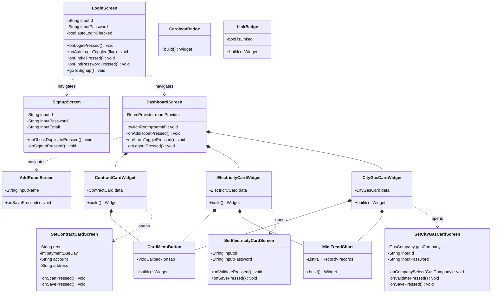

> UI 계층 클래스 요약(총 14개):
>
> | 분류 | 클래스 | 역할 | 관련 UC |
> | :--- | :--- | :--- | :---: |
> | Screen | LoginScreen | 로그인(자동로그인 토글, 아이디/비번 찾기 stub) | #2 |
> | Screen | SignupScreen | 회원가입(중복확인) | #1 |
> | Screen | DashboardScreen | 메인 대시보드, 방 전환 드롭다운·알림 토글 | #10 |
> | Screen | AddRoomScreen | 방 추가 | #3 |
> | Screen | SetContractCardScreen | 월세 카드 설정(스캔/수동) | #8, #9 |
> | Screen | SetElectricityCardScreen | 전기 로그인 입력·검증 | #4 |
> | Screen | SetCityGasCardScreen | 가스 로그인 입력·검증(회사 드롭다운) | #5 |
> | Widget | ContractCardWidget | 월세 카드 표시(계좌·주소 복사) | #11 |
> | Widget | ElectricityCardWidget | 전기 카드 표시(차트) | #12 |
> | Widget | CityGasCardWidget | 가스 카드 표시(차트) | #13 |
> | Widget | CardMenuButton | 카드 설정 버튼(설정 화면으로 이동) | 공통 |
> | Widget | MiniTrendChart | fl_chart 월별 추이 미니 차트(전기/가스 공유) | #12, #13 |
> | Widget | CardIconBadge | 카드 아이콘 배지(공통 소형 위젯) | 공통 |
> | Widget | LinkBadge | 연결 상태(연결됨/미연결) 배지(공통) | 공통 |

## 2.4.1 State & Service layer — class diagram

```mermaid
classDiagram
    class AuthService {
        -StorageService _storage
        -SecureStorageService _secure
        -User? _currentUser
        +User? currentUser
        +bool isLoggedIn
        +checkDuplicateId(id) bool
        +signUp(id, password, email) bool
        +login(id, password, autoLogin) bool
        +checkAutoLogin() bool
        +logout() void
    }
    class RoomProvider {
        -StorageService _storage
        -List~Room~ _rooms
        -Room? _currentRoom
        +List~Room~ rooms
        +Room? currentRoom
        +bool isLoading
        +loadRooms(ownerId) void
        +ensureLoaded(ownerId) void
        +addRoom(ownerId, name) Room
        +switchRoom(roomId) void
        +clear() void
    }
    class StorageService {
        +insertUser(User) void
        +getUserById(id) User?
        +userExists(id) bool
        +insertRoom(Room) void
        +getRoomsByOwner(ownerId) List~Room~
        +updateRoom(Room) void
        +deleteRoom(roomId) void
        +upsertContractCard(card) void
        +getContractCard(roomId) ContractCard?
        +upsertElectricityCard(card) void
        +getElectricityCard(roomId) ElectricityCard?
        +upsertCityGasCard(card) void
        +getCityGasCard(roomId) CityGasCard?
        +insertBillRecord(record) void
        +getBillRecords(cardId, limit) List~BillRecord~
    }
    class SecureStorageService {
        +saveAutoLoginToken(userId, token) void
        +getAutoLoginToken() String?
        +getAutoLoginUserId() String?
        +deleteAutoLoginToken() void
        +saveElectricityCredentials(prefix, loginId, loginPassword) void
        +getElectricityLoginId(prefix) String?
        +saveCityGasCredentials(prefix, loginId, loginPassword) void
        +getCityGasLoginId(prefix) String?
        +deleteAll() void
    }
    class AlarmService {
        -bool _enabled
        -List~AlarmInfo~ _scheduled
        +bool isEnabled
        +init() void
        +requestPermission() bool
        +setEnabled(value) void
        +schedulePaymentAlarm(alarmId, roomName, paymentDueDay) void
        +cancelAlarm(alarmId) void
        +cancelAll() void
    }
    class AlarmInfo {
        +String alarmId
        +String title
        +String body
        +DateTime scheduledAt
    }
    class ExternalProvider {
        <<interface>>
        +authenticate(loginId, loginPassword) bool
        +fetchBillHistory(cardId, cardType) List~BillRecord~
        +fetchCurrentMonthAmount(cardId, cardType) int?
    }
    class ExternalProviderStub {
        +authenticate(...) bool
        +fetchBillHistory(...) List~BillRecord~
        +fetchCurrentMonthAmount(...) int?
    }
    class ContractScanner {
        <<interface>>
        +scanFromFile(imagePath) ScanResult
        +scanFromCamera() ScanResult
    }
    class ContractScannerStub {
        +scanFromFile(...) ScanResult
        +scanFromCamera(...) ScanResult
    }
    class ScanResult {
        +int? monthlyRentWon
        +int? paymentDueDay
        +String? bankAccount
        +String? address
        +bool success
        +String? errorMessage
    }

    AuthService --> StorageService : uses
    AuthService --> SecureStorageService : uses
    RoomProvider --> StorageService : uses
    AlarmService --> AlarmInfo : tracks
    ExternalProviderStub ..|> ExternalProvider : implements
    ContractScannerStub ..|> ContractScanner : implements
    ContractScannerStub --> ScanResult : returns
```

## 2.4.2 State & Service layer — class descriptions

#### AuthService (Provider, 클라이언트)

| Member | Type/Returns | Vis | Description |
| :--- | :--- | :---: | :--- |
| _currentUser | User | - | 현재 로그인 사용자(미로그인 시 null) |
| currentUser / isLoggedIn | User / bool | + | 현재 사용자·로그인 여부 getter |
| checkDuplicateId(id) | bool | + | 아이디 중복 확인 |
| signUp(id, password, email) | bool | + | 회원가입(중복 검사 후 해시 저장) |
| login(id, password, autoLogin) | bool | + | 로그인. 자동로그인 시 토큰 저장 |
| checkAutoLogin() | bool | + | 앱 시작 시 토큰 기반 자동 로그인 |
| logout() | void | + | 로그아웃 + 토큰·알림 정리 |

#### RoomProvider (Provider)

| Member | Type/Returns | Vis | Description |
| :--- | :--- | :---: | :--- |
| _rooms / _currentRoom | List\<Room\> / Room? | - | 방 목록·현재 방 내부 상태 |
| rooms / currentRoom / isLoading | List\<Room\> / Room? / bool | + | 외부 노출 getter |
| loadRooms(ownerId) | void | + | 사용자의 방 목록 로드 |
| ensureLoaded(ownerId) | void | + | 미로드 시에만 로드(중복 방지) |
| addRoom(ownerId, name) | Room | + | 방 + 빈 카드 3종 생성, 현재 방 전환 |
| switchRoom(roomId) | void | + | 현재 방 전환 |
| clear() | void | + | 로그아웃 시 상태 비움 |

#### AlarmService (Provider)

| Member | Type/Returns | Vis | Description |
| :--- | :--- | :---: | :--- |
| _enabled / _scheduled | bool / List\<AlarmInfo\> | - | 알림 허용 여부·예약 목록 |
| isEnabled | bool | + | 알림 허용 여부 getter |
| init() / requestPermission() | void / bool | + | 초기화·권한 요청 |
| setEnabled(value) | void | + | 알림 허용 토글(끄면 예약 생략) |
| schedulePaymentAlarm(alarmId, roomName, paymentDueDay) | void | + | 납부일 D-3 09:00 매월 반복 예약 |
| cancelAlarm(alarmId) / cancelAll() | void | + | 예약 1건/전체 취소 |

#### AlarmInfo (value object)

| Member | Type | Vis | Description |
| :--- | :--- | :---: | :--- |
| alarmId / title / body | String | + | 알림 식별자·제목·본문 |
| scheduledAt | DateTime | + | 예약된 발생 시각 |

#### StorageService (Service)

| Operation | Returns | Vis | Description |
| :--- | :--- | :---: | :--- |
| insertUser / getUserById / userExists | void / User / bool | + | 사용자 저장·조회·존재 확인 |
| insertRoom / getRoomsByOwner / updateRoom / deleteRoom | void / List\<Room\> / void / void | + | 방 CRUD |
| upsert*Card / get*Card | void / Card | + | 카드 3종(Contract·Electricity·CityGas) 저장·조회 |
| insertBillRecord / getBillRecords | void / List\<BillRecord\> | + | 요금 이력 저장·조회 |

#### SecureStorageService (Service)

| Operation | Returns | Vis | Description |
| :--- | :--- | :---: | :--- |
| saveAutoLoginToken / getAutoLoginToken / getAutoLoginUserId / deleteAutoLoginToken | void / String / String / void | + | 토큰 저장·조회·삭제 |
| saveElectricityCredentials / getElectricityLoginId | void / String | + | 전기 로그인 정보 보관 |
| saveCityGasCredentials / getCityGasLoginId | void / String | + | 가스 로그인 정보 보관 |
| deleteAll() | void | + | 전체 삭제(로그아웃) |

#### ExternalProvider «interface» / ExternalProviderStub

| Operation | Returns | Vis | Description |
| :--- | :--- | :---: | :--- |
| authenticate(loginId, loginPassword) | bool | + | 자격 검증(Stub은 항상 성공) |
| fetchBillHistory(cardId, cardType) | List\<BillRecord\> | + | 월별 요금 이력 조회 |
| fetchCurrentMonthAmount(cardId, cardType) | int | + | 당월 요금 조회 |

#### ContractScanner «interface» / ContractScannerStub

| Operation | Returns | Vis | Description |
| :--- | :--- | :---: | :--- |
| scanFromFile(imagePath) | ScanResult | + | 이미지 파일 OCR |
| scanFromCamera() | ScanResult | + | 카메라 촬영 OCR |

#### ScanResult (value object)

| Member | Type | Vis | Description |
| :--- | :--- | :---: | :--- |
| monthlyRentWon / paymentDueDay | int | + | 추출된 월세·납부일 |
| bankAccount / address | String | + | 추출된 계좌·주소 |
| success / errorMessage | bool / String | + | 성공 여부·오류 메시지 |

## 2.5.1 Backend server — class diagram

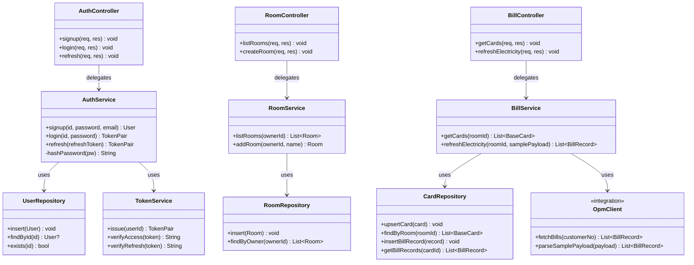

## 2.5.2 Backend server — class descriptions

#### AuthController / RoomController / BillController (Controller 계층)

| Controller | 주요 핸들러(엔드포인트) | Description |
| :--- | :--- | :--- |
| AuthController | signup·login·refresh (`/auth/*`) | 가입·로그인·토큰 재발급 |
| RoomController | listRooms·createRoom (`/rooms`) | 방 목록·생성 |
| BillController | getCards·refreshElectricity (`/rooms/:id/cards*`) | 카드 조회·전기요금 갱신 |

#### AuthService (서버)

| Operation | Returns | Vis | Description |
| :--- | :--- | :---: | :--- |
| signup(id, password, email) | User | + | 중복 검사 후 해시 저장 |
| login(id, password) | TokenPair | + | 자격 검증 후 토큰 쌍 발급 |
| refresh(refreshToken) | TokenPair | + | refresh 토큰으로 재발급 |
| hashPassword(pw) | String | - | SHA-256(+salt) 해시 |

#### RoomService (서버)

| Operation | Returns | Vis | Description |
| :--- | :--- | :---: | :--- |
| listRooms(ownerId) | List\<Room\> | + | 사용자 방 목록 |
| addRoom(ownerId, name) | Room | + | 방 + 빈 카드 3종 생성 |

#### BillService (서버)

| Operation | Returns | Vis | Description |
| :--- | :--- | :---: | :--- |
| getCards(roomId) | List\<BaseCard\> | + | 방의 카드 3종 조회 |
| refreshElectricity(roomId, samplePayload) | List\<BillRecord\> | + | OpmClient 파싱 → 저장 → 반환 |

#### OpmClient (Integration 계층)

| Operation | Returns | Vis | Description |
| :--- | :--- | :---: | :--- |
| fetchBills(customerNo) | List\<BillRecord\> | + | 실 OPM 호출(실서비스용 자리, 현재 미사용) |
| parseSamplePayload(payload) | List\<BillRecord\> | + | 예시 OPM 응답(JSON) 파싱 → BillRecord |

#### TokenService (보안)

| Operation | Returns | Vis | Description |
| :--- | :--- | :---: | :--- |
| issue(userId) | TokenPair | + | access/refresh 토큰 쌍 발급 |
| verifyAccess(token) | String | + | access 검증 후 userId 반환 |
| verifyRefresh(token) | String | + | refresh 검증 후 userId 반환 |

#### UserRepository / RoomRepository / CardRepository (Data Access 계층)

| Repository | 주요 연산 | Description |
| :--- | :--- | :--- |
| UserRepository | insert·findById·exists | 사용자 영속화 |
| RoomRepository | insert·findByOwner | 방 영속화 |
| CardRepository | upsertCard·findByRoom·insertBillRecord·getBillRecords | 카드·요금 이력 영속화 |

   

---

# 3. Sequence diagram

## 3.1 Sign in / Login flow (UC #1, #2)

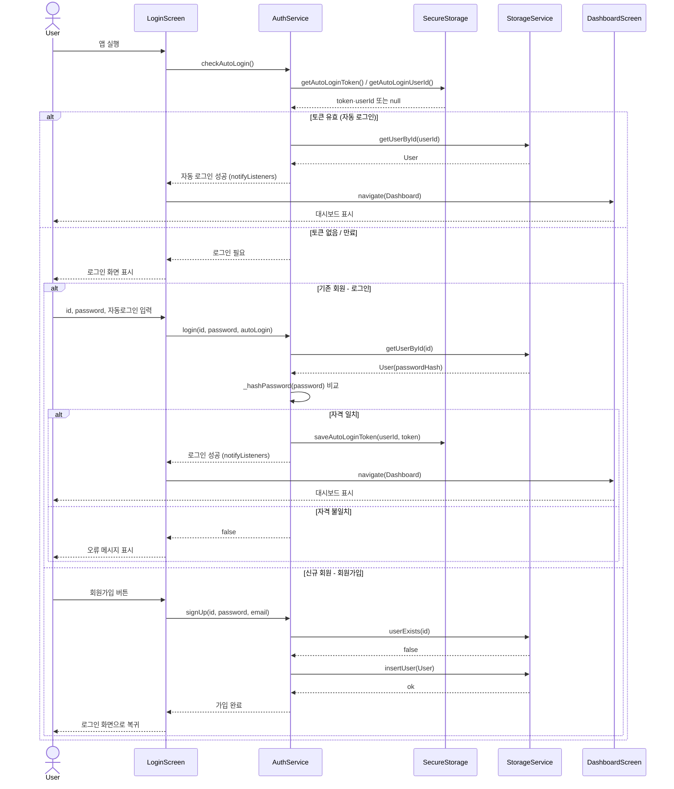

> 앱 실행 시 가장 먼저 자동 로그인을 시도한다. 토큰은 일반 DB가 아닌 SecureStorage(Keychain/Keystore)에서 읽어 보안을 확보한다(Problem 1 대응). 비밀번호는 평문 비교가 아니라 해시 검증으로 처리하며, 신규 사용자는 아이디 중복 확인 후 가입한다. 자동 로그인 성공 시 로그인 화면을 건너뛰고 곧바로 대시보드로 진입한다.

## 3.2 Add Room + Initial setup flow (UC #3)

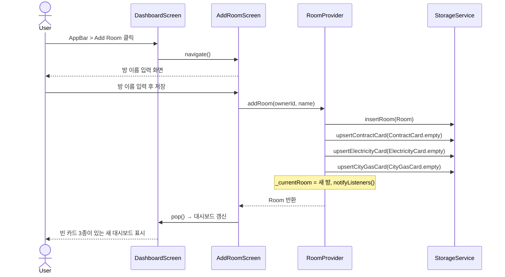

> Add Room을 실행하면 `RoomProvider.addRoom`이 Room과 함께 비어 있는 세 카드(월세·전기·가스)를 `empty()` 팩토리로 만들어 StorageService에 저장하고, 새 방을 현재 방으로 전환한 뒤 `notifyListeners()`로 대시보드를 갱신한다. 카드의 실제 내용은 이후 각 카드 설정 화면(3.4, 3.5)에서 채운다. 여러 방을 만들 수 있으므로 `ownerId`로 사용자와 연결한다.

## 3.3 View Dashboard flow (UC #10~13)

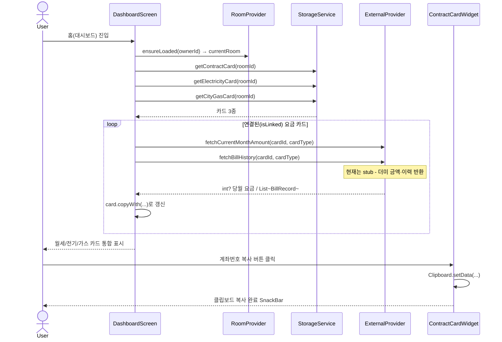

> 대시보드 진입 시 `RoomProvider`로 현재 방을 정하고, 로컬 DB에서 카드 3종을 불러와 즉시 표시한다. 연결된(`isLinked`) 요금 카드만 `ExternalProvider`로 당월 요금·이력을 갱신한다. 현재 ExternalProvider는 stub이므로 더미 데이터를 반환하지만, 실제 구현으로 교체해도 이 흐름은 그대로 유지된다(인터페이스 의존의 장점). 월세 카드의 계좌·주소 복사는 `ContractCardWidget`이 `Clipboard`로 처리한다.

## 3.4 Set Contract Card flow — OCR + 수동 입력 (UC #8, #9)

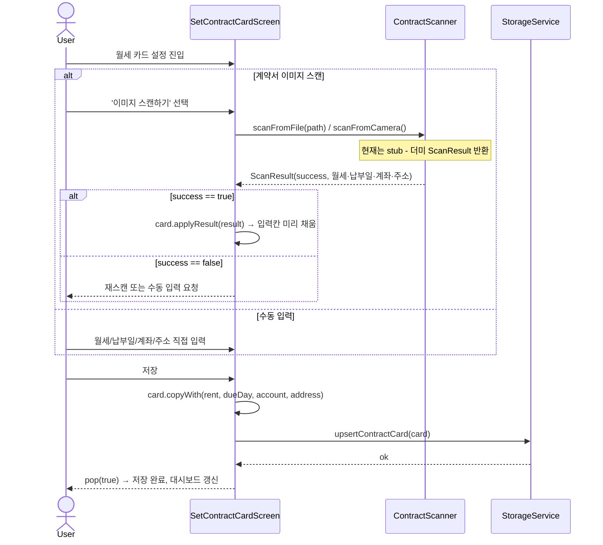

> 계약서 정보는 OCR 스캔과 수동 입력 두 경로를 제공한다. 스캔 시 `ContractScanner`가 `ScanResult`를 반환하고, 성공이면 확장 메서드 `applyResult()`로 입력칸을 미리 채운다. 수동 입력도 동일하게 `copyWith()`로 카드를 만들어 두 경로의 결과가 같아진다. 저장은 `StorageService.upsertContractCard`로 처리하고 `pop(true)`로 대시보드를 다시 로드한다. 납부일이 입력되면 이 시점에 알림도 함께 예약된다(3.5 참조). ContractScanner는 현재 stub이다.

## 3.5 Billing alarm flow (UC #14)

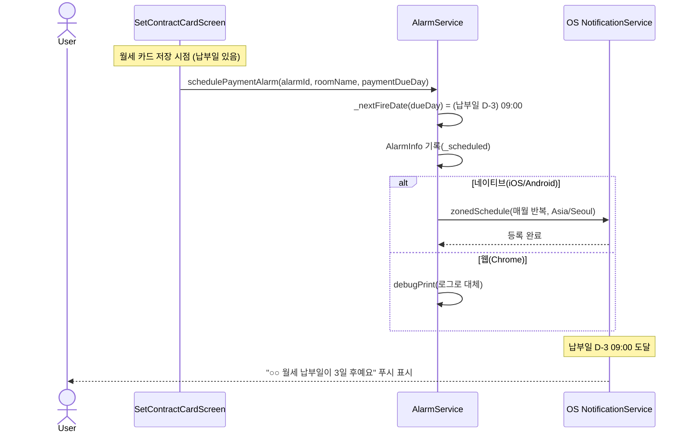

> 알림은 월세 카드 저장 시 납부일(`paymentDueDay`)을 기준으로 예약된다. `AlarmService`가 다음 발생 시각을 "납부일 D-3 오전 9시"로 계산해 매월 반복 등록하고, 예약 1건은 값 객체 `AlarmInfo`로 기록한다. 실제 발생은 OS 로컬 알림(`flutter_local_notifications`, `zonedSchedule`)에 위임한다. 알림 허용 토글(`setEnabled`)이 꺼져 있으면 예약을 생략하고, 로그아웃 시 `cancelAll()`로 모두 취소한다. 웹(Chrome)에서는 플러그인 미지원이라 콘솔 로그로 대체하며, 실제 푸시는 iOS/Android 실기기에서만 동작한다(`// TODO` 검증 예정).

## 3.6 Electricity bill fetch via backend (UC #6, 백엔드)

> 백엔드 도입 후 전기요금을 수신·표시하는 흐름이다. 클라이언트는 서버에 요청만 하고, 서버가 한전 연동(본 과제에서는 **예시 응답 파싱**)·저장·응답을 담당한다. 네트워크 경계(HTTPS/JSON)를 가로지른다.

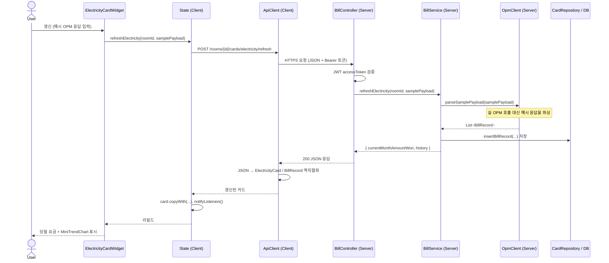

> 사용자가 예시 OPM 응답(JSON)을 넣고 버튼을 누르면, 요청이 `ApiClient`를 통해 서버로 전달되고 서버 `OpmClient.parseSamplePayload`가 이를 `BillRecord` 목록으로 해석한다. 서버는 결과를 DB에 저장한 뒤 JSON으로 응답하고, 클라이언트는 이를 Domain 객체로 되돌려 차트에 그린다. 실서비스 출시 시 `parseSamplePayload`를 실제 `fetchBills` 호출로 바꾸기만 하면 이 흐름은 그대로 유지된다(인터페이스 의존의 장점). 즉 "예시 토큰을 보내 → 서버가 해석 → 앱에 연동된 결과를 표시"라는 시연이 이 시퀀스로 성립한다.

## 3.7 Login & token authentication via backend (UC #2, 백엔드)

> 로그인이 서버 경유로 바뀐 흐름이다. 비밀번호 검증·토큰 발급은 서버가 맡고, 클라이언트는 발급받은 JWT를 보안 저장소에 보관해 이후 요청에 첨부한다.

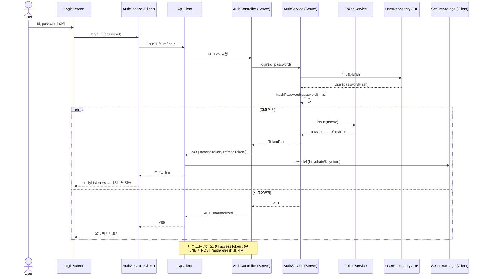

> 비밀번호 해시 비교는 이제 **서버**에서 이루어지고(클라이언트는 평문을 잠깐 들고 서버로 전송 후 폐기), 서버는 일치 시 `TokenService`로 access/refresh 토큰 쌍을 발급한다. 클라이언트 `ApiClient`는 이 토큰을 `SecureStorageService`에 저장하고 이후 모든 요청 헤더에 access 토큰을 첨부한다. access 토큰이 만료되면 refresh 토큰으로 `/auth/refresh`를 호출해 무중단으로 재발급받는다. 자동 로그인은 저장된 refresh 토큰의 유효성으로 판단한다.

   

---

# 4. State machine diagram

> 본 장은 Pocket Room 시스템 전체를 **하나의 객체로 보고**, 그 객체가 가질 수 있는 상태(State)와 상태 간 전이(Transition)를 표현한 State machine diagram이다. 사용자와의 상호작용이 중심인 모바일 앱에서 "시스템의 상태"는 곧 사용자에게 보이는 **화면(Screen)** 으로 볼 수 있다. 따라서 각 화면을 하나의 상태로, 사용자의 동작(버튼·네비게이션)에 따른 화면 전환을 전이로 표현한다. (백엔드 도입은 내부 데이터 흐름만 바꾸므로 화면 상태 구조 자체는 동일하다.)

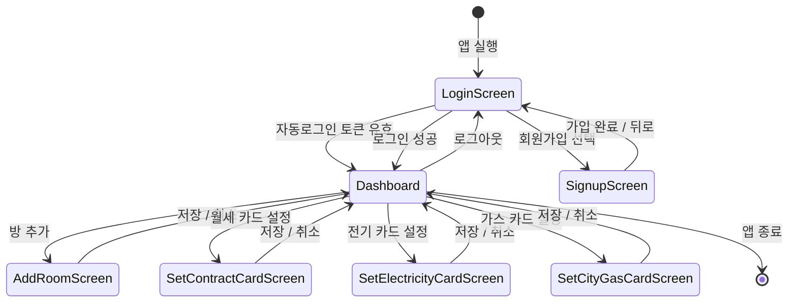

> 상태 전이의 흐름은 다음과 같다.
> - 앱을 실행하면 **LoginScreen** 상태로 진입한다. 저장된 자동로그인 토큰이 유효하면 로그인 화면을 거치지 않고 곧바로 **Dashboard** 로 전이한다.
> - 신규 사용자는 **SignupScreen** 에서 가입을 완료한 뒤 LoginScreen으로 돌아오고, 로그인에 성공하면 Dashboard로 진입한다. 로그아웃하면 다시 LoginScreen으로 돌아간다.
> - **Dashboard** 는 중심 허브 상태로, 방 추가(**AddRoomScreen**)·월세/전기/가스 카드 설정(**Set\*CardScreen**) 화면으로 전이했다가 저장 또는 취소 시 다시 Dashboard로 복귀한다.
> - 카드의 연결 여부(`isLinked`)나 요금 갱신 같은 데이터 상태 변화는 화면 내부에서 일어나며, 화면(상태) 자체는 Dashboard로 유지된다.

   

---

# 5. Implementation requirements

> Android 5.0 이상 권장
> 
> ios 12.0 이상 권장

   

---

# 6. Glossary

| 
&nbsp;&nbsp;&nbsp;&nbsp;&nbsp;Term&nbsp;&nbsp;&nbsp;&nbsp;&nbsp;
 | 
Description
 |
| :--- | :--- |
| **RoomProvider** | 방 목록·현재 방을 관리하는 상태 관리자 |
| **ExternalProvider** | 한전·도시가스와 통신해 요금을 수신하는 외부 연동 인터페이스 (현재 stub) |
| **OPM (Open P-Meter)** | 한전이 제공하는 공식 전력 데이터 연동 경로 |
| **sample payload** | 한전 OPM이 보낼 법한 형식의 예시 JSON. 실연동 대신 이를 파싱해 연동 결과를 시연 |

   

---

# 7. References

> - Open P-Meter Portal: https://opm.kepco.co.kr
> - Render: https://render.com/docs/free

